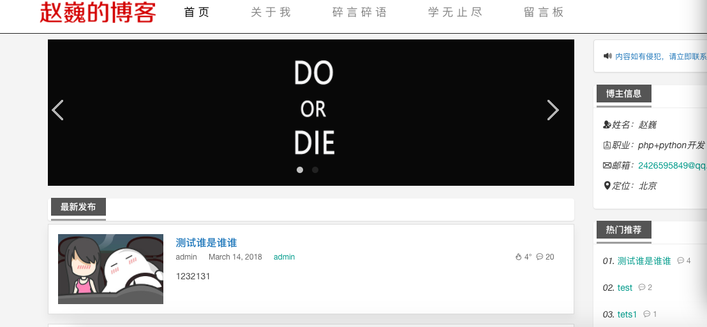
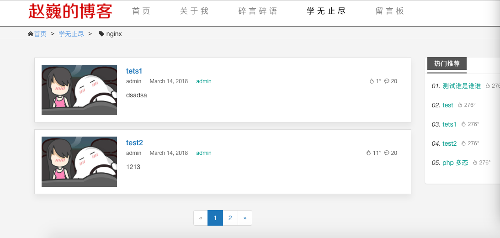

## Django搭建博客

  [](http://python.fendous.cn)
[](http://python.fendous.cn)

使用Django快速搭建博客
### 要求
* Python: 2.X
* Django: 1.10.x
* Mysql

### 示例博客：<http://python.fendous.cn>

### 特点

* 两种皮肤自由切换
* 阅读排行榜/最新评论
* 多目标源博文分享
* 博文归档
* 留言板

### 下载
```
wget https://github.com/mxfzww/python_blog/archive/master.zip
or
git clone git@github.com:mxfzww/python_blog.git
```

### 安装
```
pip install -r requirements.txt  #安装所有依赖
setting.py配置自己的数据库
python manage.py makemigrations blog
python manage.py migrate
python manage.py runserver
```

浏览器中打开<http://127.0.0.1:8000/>即可访问

## Screen Shots

* 首页


* 文章列表


* 文章内容


